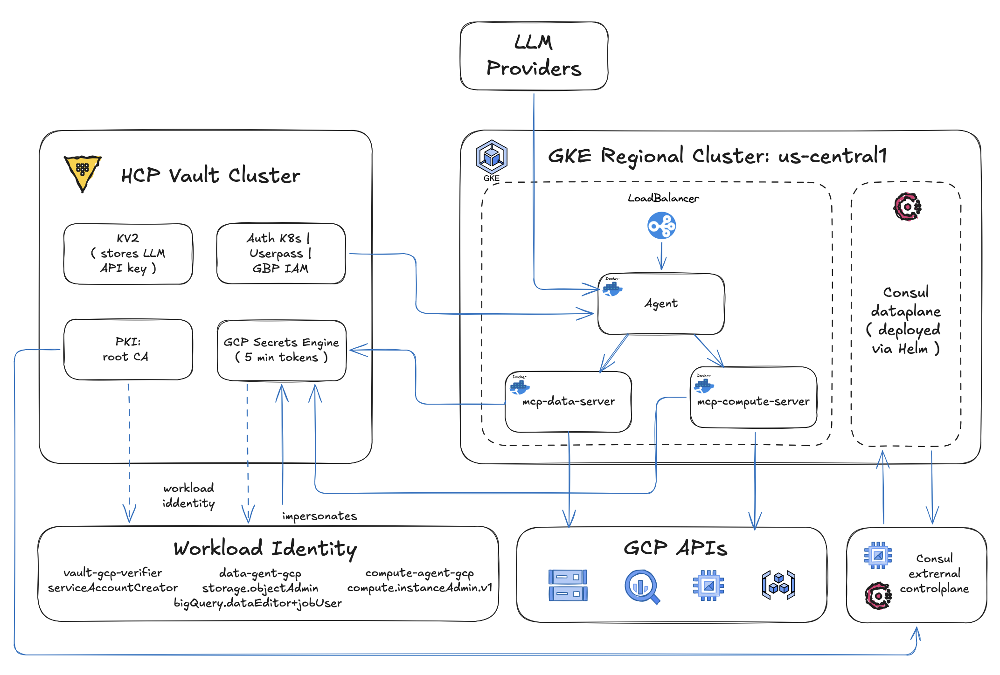
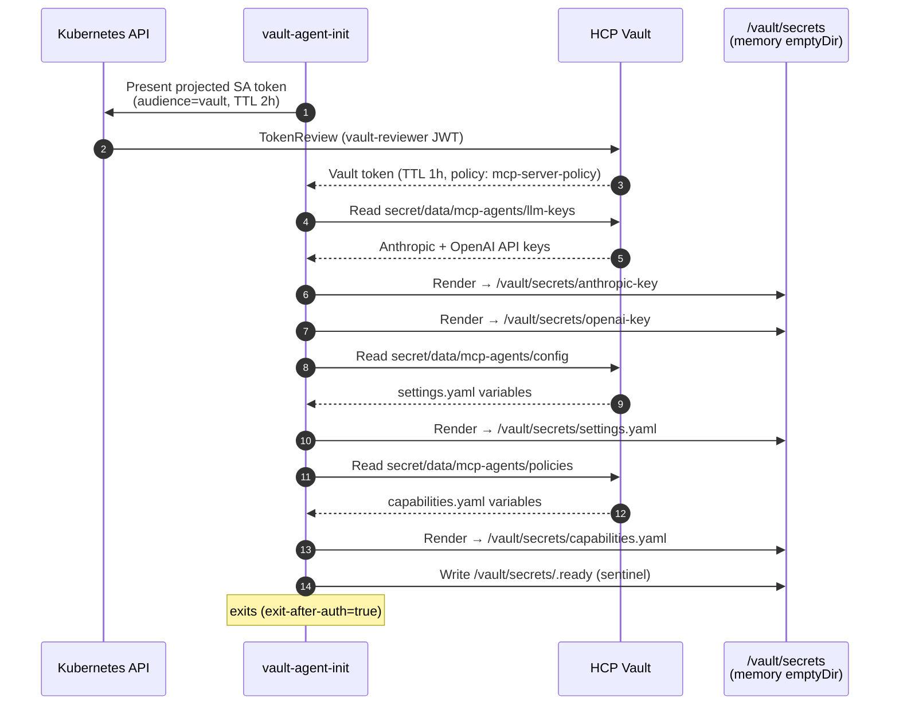
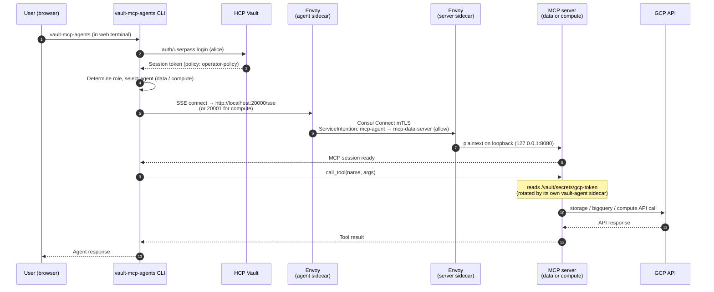
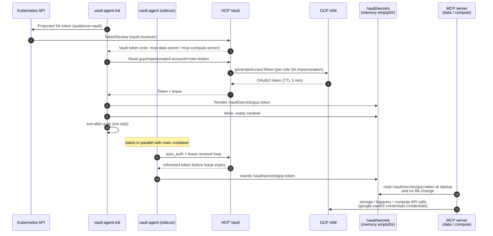
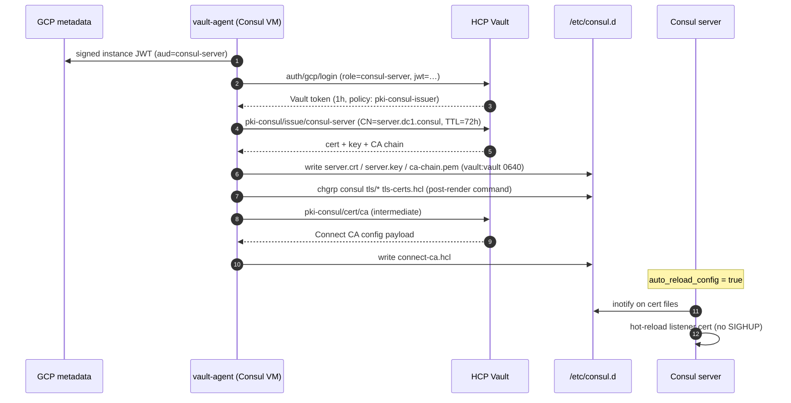

# consul-mcp-agents

**GKE + Consul service mesh + HCP Vault Dedicated + MCP AI agents on GCP.**

An end-to-end reference stack for running LLM agents that touch real cloud APIs, with **zero long-lived credentials**, **mTLS on every hop**, and **5-minute GCP tokens**. HCP Vault Dedicated is both the certificate authority for the Consul Connect mesh and a dynamic broker for GCP OAuth2 tokens; the Consul control plane runs on GCE VMs while the dataplane (Envoy sidecars) runs in GKE; the AI agents and their MCP tool servers are separate pods that talk to each other only through the mesh.

### What you get

- **An AI agent web terminal** (ttyd) where authenticated users drive an LLM with role-scoped tools against GCS, BigQuery, and Compute Engine.
- **Three trust boundaries between user prompt and a GCP API call**: Vault userpass (who you are) → Consul intentions (which services may speak) → `capabilities.yaml` (which tools the LLM sees).
- **No secrets in images, manifests, or environment variables** — every credential is rendered by vault-agent into tmpfs and rotated under TTL.
- **A turn-key deployment**: ~25–35 min from `task all` to a working web terminal, with phase-gated Terraform that handles HCP Vault → Vault PKI → Consul VMs → GKE → MCP pods in the right order.

### Who it's for

Platform engineers and security architects evaluating how to give LLM agents real cloud capabilities without handing out static API keys; HashiCorp customers wanting an opinionated reference for HCP Vault + Consul + GKE; teams who want a working artefact to fork rather than a slideware diagram.

### Table of contents

- [Architecture](#architecture) — component stack, certificate chain, credential flow, what lives in Vault
- [How Vault Brokers Secrets to Agents and MCP Servers](#how-vault-brokers-secrets-to-agents-and-mcp-servers) — per-pod auth, what gets rendered, secret lifetimes
- [Vault ↔ Consul Integration](#vault--consul-integration) — Vault PKI as Connect CA, vault-agent on Consul VMs, cert renewal
- [Prerequisites](#prerequisites) — tools, GCP setup, HCP setup
- [Quick Start](#quick-start) — clone, configure, deploy, log in
- [Deployment Phases](#deployment-phases) — why the apply is split, in what order
- [Individual Component Operations](#individual-component-operations) — Taskfile commands per component
- [Directory Structure](#directory-structure)
- [Security Design](#security-design)
- [Troubleshooting](#troubleshooting)

---

## Architecture



### Component Stack

| Layer | Component | Purpose |
|-------|-----------|---------|
| Identity & Secrets | HCP Vault Dedicated | PKI CA, GCP dynamic creds, config store, human + pod auth |
| Service Mesh CA | Vault PKI (Root + Intermediate) | Issues mTLS leaf certs for Consul Connect |
| Control Plane | Consul VMs (external) | External Consul control plane for GKE dataplane mode |
| Compute | GKE (regional cluster) | Runs MCP agent pods; Consul dataplane in sidecar proxies |
| Credentials | Vault GCP Secrets Engine | 5-minute OAuth2 tokens via service account impersonation |
| Agent AI | vault-mcp-agents (Python) | Anthropic/OpenAI SDK adapter + MCP tool servers (GCS, BigQuery, GCE) |
| User Access | ttyd web terminal | Browser-based access to the `vault-mcp-agents` CLI inside the pod |

### Certificate Chain

```
HCP Vault PKI
  └── Root CA  (connect-root)          10-year validity, never exported
        └── Intermediate CA  (connect-intermediate)  5-year validity
              └── Consul Connect leaf certs          72h, auto-rotated
              └── Consul server TLS certs            72h, auto-rotated
```

### Credential Flow (5-Minute GCP Tokens)

```
User → Vault userpass login → Session token
  → Agent selects role + agent, opens MCP connection over the Consul mesh
  → (mTLS hop through Envoy sidecars; ServiceIntention authorises)
  → MCP server pod calls tool handler
  → Reads /vault/secrets/gcp-token (refreshed by its vault-agent sidecar)
  → Token came from: Vault GCP secrets engine → GCP generateAccessToken API
  → OAuth2 token (TTL: 5 min, enforced server-side by Vault lease)
  → GCS / BigQuery / GCE API call
```

The agent process never fetches GCP credentials itself. Each MCP server pod owns its own Vault role and its own GCP impersonation chain — the agent's compromise blast radius is "issue MCP RPCs the intentions allow," not "mint GCP tokens."

### What Lives in Vault

| Secret Path | Content | Consumer |
|---|---|---|
| `connect-root/` | PKI Root CA | Consul TLS trust anchor |
| `connect-intermediate/` | PKI Intermediate CA | Issues leaf certs to Consul |
| `auth/gcp` | GCP IAM auth method | Consul server VM vault-agent |
| `auth/kubernetes` | K8s auth method | GKE pod vault-agent |
| `auth/userpass` | Human user accounts | MCP CLI users |
| `gcp/impersonated-account/data-agent-gcp` | GCP OAuth2 tokens (5-min) | data_agent MCP server |
| `gcp/impersonated-account/compute-agent-gcp` | GCP OAuth2 tokens (5-min) | compute_agent MCP server |
| `secret/mcp-agents/config` | settings.yaml content | MCP pods via vault-agent |
| `secret/mcp-agents/policies` | capabilities.yaml content | MCP pods via vault-agent |
| `secret/mcp-agents/llm-keys` | Anthropic/OpenAI API keys | MCP pods via vault-agent |
| `secret/consul/acl-token` | Consul bootstrap ACL token | Written post-bootstrap |

---

## How Vault Brokers Secrets to Agents and MCP Servers

Two distinct pod types live in the `mcp-agents` namespace and they consume Vault differently:

| Pod | Authenticates as | vault-agent shape | What gets rendered |
|---|---|---|---|
| `mcp-agent` (CLI + ttyd) | Vault role `mcp-server`, SA `mcp-server` | **Init only** (`exit-after-auth=true`) | LLM API keys, `settings.yaml`, `capabilities.yaml` (static at pod boot) |
| `mcp-data-server`, `mcp-compute-server` | Per-server Vault role bound to its own SA | **Init + sidecar** (`exit_after_auth=false`) | `/vault/secrets/gcp-token` from a dynamic GCP impersonation engine, refreshed on its own |

Both pod types use the same Kubernetes auth method (`auth/kubernetes`) and the same projected-SA-token / TokenReview chain — they differ only in role bindings, template content, and whether the agent process keeps running.

### Agent pod: Phase 1 — vault-agent init container

The `mcp-agent` pod runs a `vault-agent-init` container before the main container starts. It authenticates to Vault once, renders all static secrets into a shared memory volume, then exits.



**Authentication details:**

| Field | Value |
|---|---|
| Auth method | Kubernetes (`auth/kubernetes`) |
| JWT source | Projected SA token at `/var/run/secrets/vault/token` |
| SA | `mcp-server` in namespace `mcp-agents` |
| Vault role | `mcp-server` — bound to that SA + namespace |
| Token reviewer | `vault-reviewer` SA in `kube-system` (managed by Terraform) |

**Secrets rendered at startup:**

| Vault path | Rendered file | Contents |
|---|---|---|
| `secret/data/mcp-agents/llm-keys` | `/vault/secrets/anthropic-key`<br/>`/vault/secrets/openai-key` | Raw API key values |
| `secret/data/mcp-agents/config` | `/vault/secrets/settings.yaml` | Vault addr, GCP project, agent definitions, MCP server upstream URLs |
| `secret/data/mcp-agents/policies` | `/vault/secrets/capabilities.yaml` | Role → tool allowlists, max GCP token TTL |

All files land in an `emptyDir` volume with `medium: Memory` — they never touch node disk.

### Agent pod: Phase 2 — main container startup

`docker/entrypoint.sh` waits for the `.ready` sentinel (max 120 s), then:

```bash
# Read rendered files and export as env vars for the ttyd subprocess
ANTHROPIC_API_KEY=$(cat /vault/secrets/anthropic-key)
OPENAI_API_KEY=$(cat /vault/secrets/openai-key)
export ANTHROPIC_API_KEY OPENAI_API_KEY
exec ttyd ... vault-mcp-agents ...
```

The application reads `settings.yaml` and `capabilities.yaml` from the same volume at import time.

### Agent pod: Phase 3 — runtime, per user session

When a user logs in through the web terminal:



The agent process never sees a GCP credential. Two independent trust hops protect every tool call: **Consul Connect mTLS + ServiceIntentions** authorise the agent→server RPC, and the server's own **vault-agent sidecar** mints a fresh 5-minute GCP token from Vault (renewed in place ahead of every lease expiry). `capabilities.yaml` is an LLM-level allow-list layered on top — see the next section for how the server pod manages its token.

### MCP server pods (`mcp-data-server`, `mcp-compute-server`)

The data and compute servers don't hold LLM keys, app config, or user sessions — their only Vault dependency is a continuously-fresh GCP OAuth2 token. They use a **vault-agent sidecar** (not just an init container) so Vault keeps the token file rotated for the life of the pod.



| Field | mcp-data-server | mcp-compute-server |
|---|---|---|
| Vault role | `mcp-data-server` | `mcp-compute-server` |
| Pod SA | `mcp-data-server` (mcp-agents ns) | `mcp-compute-server` (mcp-agents ns) |
| Vault path templated | `gcp/impersonated-account/data-agent-gcp/token` | `gcp/impersonated-account/compute-agent-gcp/token` |
| Impersonates | `data-agent-gcp` SA (`storage.objectAdmin`, `bigquery.dataEditor`+`jobUser`) | `compute-agent-gcp` SA (`compute.instanceAdmin.v1`) |

The sidecar is configured with `exit_after_auth = false` and a single `template` block (see `templates/vault-agent-server.hcl.tpl`), so the file at `/vault/secrets/gcp-token` is overwritten in place ahead of every lease expiry. The MCP server reads the file at startup and re-reads it on the next call when authentication fails — no Vault SDK in the server process.

### Secret lifetime summary

| Secret | Fetched | TTL | Stored in |
|---|---|---|---|
| Kubernetes projected SA JWT | Pod creation | 2 h | `/var/run/secrets/vault/` (K8s managed) |
| Vault pod token | Init container | 1 h | `/home/vault/.vault-token` (emptyDir) |
| LLM API keys | Init container | Until pod restart | `/vault/secrets/` (memory emptyDir) |
| `settings.yaml`, `capabilities.yaml` | Init container | Until pod restart | `/vault/secrets/` (memory emptyDir) |
| Vault user session token | User login | Policy TTL | Python process memory |
| GCP OAuth2 token (MCP server pods) | vault-agent sidecar lease loop | 5 min, rewritten before expiry | `/vault/secrets/gcp-token` (memory emptyDir) |

---

## Vault ↔ Consul Integration

Vault plays two roles for Consul: it is the **Connect CA provider** (every mTLS leaf cert in the mesh is issued via Vault PKI) and the **server-TLS source** (the gossip + RPC listener cert/key/CA). Both flows are driven by a vault-agent running on each Consul server VM — no operator-supplied secrets, no cert material in Packer images or Terraform state.

### Authentication: GCP IAM, not Kubernetes

Consul VMs are GCE instances, not pods, so the K8s auth method doesn't apply. They authenticate via Vault's **GCP IAM auth method**:

| Field | Value |
|---|---|
| Auth method | `auth/gcp` (type `iam`) |
| Identity | Instance metadata-service signed JWT, audience = Vault role |
| Vault role | `consul-server` — bound to the Consul server SA email |
| Token policy | `pki-consul-issuer` + `kv-consul-acl-token` (read CA, issue leaf certs, read bootstrap token) |

The same SA is referenced by the scenario's `vault-pki` PKI roles and by the GCE instance — the `consul_server_sa_email` input wires both together so the prefix can never drift (this was historically a foot-gun; see CLAUDE.md / MEMORY.md).

### What vault-agent renders on a Consul server

`packer/configs/vault-agent-consul.hcl.tmpl` defines four `template` blocks; vault-agent renders them at boot and refreshes them as leases approach expiry.

| Template destination | Vault source | Used by Consul for |
|---|---|---|
| `/etc/consul.d/tls/ca-chain.pem` | `pki-consul/cert/ca_chain` | TLS trust anchor (RPC + HTTPS API) |
| `/etc/consul.d/tls/server.crt` + `server.key` | `pki-consul/issue/consul-server` (72h leaf) | TLS listener cert/key |
| `/etc/consul.d/tls-certs.hcl` | n/a (paths only) | `tls { defaults { cert_file=… key_file=… ca_file=… } }` block |
| `/etc/consul.d/connect-ca.hcl` | `pki-consul/cert/ca` (intermediate) | `connect { ca_provider = "vault" ca_config { … } }` — tells Consul to use Vault PKI as the Connect CA |



### Permission plumbing on the VM

A few non-obvious file-permission rules exist because vault-agent and Consul run as different Unix users:

- vault-agent writes everything as `vault:vault 0640`.
- Packer adds `consul` to the `vault` group (`usermod -aG vault consul`) so it can read those files.
- Each template's post-render `command` runs `chgrp consul …` on the rendered files (defence-in-depth — the template engine drops setgid otherwise).
- `/etc/consul.d/` is `0770` and `/etc/consul.d/tls/` is `2770` (setgid) so vault-agent can write into them.

Losing any one of these breaks Consul boot — see CLAUDE.md "Consul TLS" for the full failure-mode catalogue.

### Cert renewal — without `systemctl reload`

vault-agent v1.21.3 fixed a long-standing `pkiCert` non-renewal bug, so the templates renew themselves. As belt-and-braces:

- A systemd timer runs `vault-agent-cert-refresh.sh` every 60 hours (cert TTL is 72h). The script issues a fresh cert via the Vault PKI REST API and replaces the files atomically.
- Consul has `auto_reload_config = true` in `consul-server.hcl`, so it picks up the new cert files via inotify — **no SIGHUP, no `systemctl reload consul`**.
- This matters because reloading Consul causes it to re-initialize the Vault Connect CA provider, which mints a fresh Connect intermediate CA and invalidates every mesh leaf cert in flight. Use `task consul:refresh-tls` (or run the refresh script directly) for cert renewal — never `systemctl reload`.

### GKE side: how pods trust the Connect CA

GKE pods that join the mesh (via the Consul Helm chart's connect-injector) need the same Connect intermediate CA chain that the VMs are using. That's brokered as a Kubernetes Secret rather than a Vault read:

- `kubernetes_secret.consul_ca_cert` (key `tls.crt`) is seeded by Terraform during Phase 2 and lives in the `consul` namespace.
- It has `lifecycle { ignore_changes = [data] }` — Terraform never overwrites the live data after creation.
- `task consul:refresh-tls` re-reads `ca-chain.pem` from the running Consul VM and `kubectl apply`s it back into the secret. Run it before every Helm deploy (and any time the Connect CA actually rotates) to keep the cluster's trust anchor in sync.

### Why this design

- **Single CA root for VM TLS *and* Connect mTLS** — operators audit one PKI, not two. PKI TTLs (root 10y, intermediate 5y, leaf 72h) are uniform across the mesh.
- **No long-lived TLS material on the VM** — Packer images contain no certs; a hijacked image can't impersonate a server without first authenticating to Vault as the consul-server GCP SA.
- **No app-level secret distribution code** — neither Consul nor the MCP servers contain Vault-client SDK calls for TLS or GCP credentials. vault-agent owns the lease loop; the apps just read files.

---

## Prerequisites

| Tool | Version | Install |
|------|---------|---------|
| Terraform | >= 1.9.0 | [terraform.io](https://terraform.io) |
| Packer | >= 1.10.0 | [packer.io](https://packer.io) |
| Task | >= 3.0 | `brew install go-task` |
| gcloud | latest | [cloud.google.com/sdk](https://cloud.google.com/sdk) |
| kubectl | >= 1.28 | `gcloud components install kubectl` |
| docker | >= 24.0 | [docs.docker.com](https://docs.docker.com) |
| vault CLI | >= 1.17 | [vaultproject.io](https://vaultproject.io) |
| jq | >= 1.6 | `brew install jq` |

### GCP Requirements

- A GCP project with billing enabled
- `roles/owner` or custom role with: `compute.*`, `container.*`, `iam.*`, `artifactregistry.*`
- APIs enabled: Compute Engine, GKE, IAM, Artifact Registry, Cloud NAT

### HCP Requirements

- HCP account at [portal.cloud.hashicorp.com](https://portal.cloud.hashicorp.com)
- A **service principal** with `Contributor` role (create in HCP → Access control → Service principals)
- Note the **Client ID** and **Client Secret** — used in terraform.tfvars

---

## Quick Start

### Step 1: Clone the consul-mcp-agents repo

```bash
git clone consul-mcp-agents.git
cd consul-mcp-agents
```

### Step 2: Configure the terraform.tfvars file

```bash
cp tf/scenarios/consul-mcp-gke/terraform.tfvars.example \
   tf/scenarios/consul-mcp-gke/terraform.tfvars

# Edit terraform.tfvars

#
# 1. Replace the "your-gcp-project-id" placeholder with your actual GCP project id:
#

# ---- GCP ----
gcp_project_id = "your-gcp-project-id"
gcp_region     = "us-central1"
gcp_zone       = "us-central1-a"
environment    = "dev"

#
# 2. Replace the "your-hcp-client-id" and "your-hcp-client-secret" with your own HCP credentials
#

# ---- HCP ----
# Create a service principal in HCP portal → Access control → Service principals
hcp_client_id     = "your-hcp-client-id"
hcp_client_secret = "your-hcp-client-secret"
hcp_hvn_cidr      = "172.25.16.0/20"  # Must not overlap GCP subnets
hcp_vault_tier    = "plus_small"

#
# 3. Enter your LLM provider API key here in place of the placeholder
#

# ---- LLM ----
llm_provider     = "anthropic"
llm_model        = "claude-sonnet-4-6"
anthropic_api_key = "sk-ant-..."  # Your Anthropic API key
```

### Step 3: Authenticate with GCP

All four commands below are required before deploying. `task preflight` will verify them.

```bash
# 1. User login — authenticates gcloud CLI, kubectl, and Taskfile tasks
gcloud auth login

# 2. Application Default Credentials — used by Terraform's google provider
gcloud auth application-default login

# 3. Set the active project (must match gcp_project_id in terraform.tfvars)
gcloud config set project <your-project-id>

# 4. Docker credential helper — allows pushing images to Artifact Registry
gcloud auth configure-docker <region>-docker.pkg.dev   # e.g. us-central1-docker.pkg.dev
```

| Command | Used by |
|---------|---------|
| `gcloud auth login` | `gcloud`, `kubectl`, Taskfile tasks (`consul:*`, `gke:*`, `packer:build`) |
| `gcloud auth application-default login` | Terraform GCP provider, Packer, any Google client library |
| `gcloud config set project` | Default `--project` for all `gcloud` commands |
| `gcloud auth configure-docker` | `task docker:push` — authenticates Docker to Artifact Registry |

### Step 4: Create state bucket and set backend

```bash
task tf:backend:create
# Update tf/scenarios/consul-mcp-gke/versions.tf with the bucket name
```

### Step 5: Check preflight

```bash
task preflight
```

### Step 6: Run full deployment

```bash
task all
# This takes ~25-35 minutes total:
#   Phase 1 (Vault + PKI + Consul):  ~10 min
#   Phase 2 (GKE + Consul Helm):     ~15 min
#   Phase 3 (MCP agents):             ~2 min
```

### Step 7: Access the web terminal

```bash
task mcp:url
# Navigate to http://<IP>/ in your browser
# Log in with: alice/alice-pass (operator), bob/bob-pass (analyst), carol/carol-pass (viewer)
```
---

## Deployment Phases

The deployment is split into phases to handle Terraform dependency ordering:

```
Phase 1a: Network (VPC, subnets, Cloud NAT)
Phase 1b: HCP Vault (HVN + Vault cluster + VPC peering)
Phase 1c: Vault PKI (Root CA + Intermediate CA + GCP auth roles)
Phase 1d: Vault Config (KV secrets, GCP engine, userpass, K8s auth skeleton)
Phase 1e: Consul VMs (boot with vault-agent → GCP IAM auth → certs from Vault PKI)

Phase 2:  GKE Cluster + Consul dataplane Helm (TLS via Vault PKI CA cert)

Post-GKE: vault:configure-k8s-auth (fills in GKE endpoint + CA in Vault K8s auth)

Phase 3:  MCP agent Docker image build + push to Artifact Registry
Phase 4:  MCP agent Kubernetes Deployment + Services
```

### Why phases?

- **HCP Vault** must exist before Vault PKI/config can be applied
- **Vault PKI** must exist before Consul VMs boot (vault-agent fetches certs)
- **Consul VMs** must be running before GKE Helm chart can connect to external servers
- **GKE cluster endpoint** is only known after GKE apply — needed for Vault K8s auth config
- **Vault K8s auth** must be configured before MCP pods can authenticate to Vault

---

## Individual Component Operations

### Vault

```bash
task vault:status              # Check Vault cluster health
task vault:login:operator      # Log in as alice (operator role)
task vault:configure-k8s-auth  # Re-configure K8s auth (after cluster changes)
```

### Consul

```bash
task consul:status             # Check Consul member list (via IAP SSH)
```

### GKE

```bash
task gke:ensure-ready          # Get kubeconfig + set phase gate + update private endpoint
task gke:nodes                 # List cluster nodes
```

### MCP Agents

```bash
task mcp:status                # Pod and service status
task mcp:url                   # Get web terminal URL
task mcp:logs                  # Tail pod logs
task mcp:exec                  # Shell into a pod
task mcp:restart               # Rolling restart
```

### Docker

```bash
task docker:build              # Build image with current git SHA tag
task docker:push               # Push to Artifact Registry
task docker:run-local          # Run locally against local Vault dev server
```

### Diagrams

```bash
task diagrams:generate         # Generate/regenerate architecture PNGs
```

---

## Directory Structure

```
consul-mcp-agents/
├── Taskfile.yml                    # Orchestration (run: task --list for all tasks)
├── README.md                       # This file
├── .gitignore
│
├── docker/
│   ├── Dockerfile                  # Multi-stage Python + vault + ttyd image
│   └── entrypoint.sh               # Container entrypoint (waits for vault-agent, starts ttyd)
│
├── packer/
│   ├── gcp-almalinux-consul-server.pkr.hcl   # Consul server VM image (with vault-agent)
│   ├── configs/
│   │   ├── consul-server.hcl                  # Base Consul server config (baked in)
│   │   └── vault-agent-consul.hcl.tmpl        # vault-agent config template (rendered at boot)
│   └── scripts/
│       ├── provision-consul.sh                 # Install Consul binary + systemd
│       └── provision-vault-agent.sh            # Install vault-agent binary + systemd
│
├── docs/
│   └── diagrams/
│       ├── generate_diagrams.py               # Matplotlib diagram generator
│       ├── overall-architecture.png
│       ├── vault-pki-chain.png
│       ├── credential-flow.png
│       └── deployment-sequence.png
│
└── tf/
    ├── modules/
    │   ├── hcp-vault/                # HCP HVN + Vault Dedicated + VPC peering
    │   ├── vault-pki-consul/         # Root CA + Intermediate CA + GCP auth + policies
    │   ├── vault-config/             # KV secrets + GCP engine + userpass + K8s auth
    │   ├── network/                  # VPC + subnets + Cloud NAT + firewalls
    │   ├── consul/                   # Consul server VMs (GCE instances)
    │   ├── gke-consul-dataplane/     # GKE cluster + Consul Helm (TLS-enabled)
    │   └── mcp-agents-k8s/           # K8s namespace + SA + vault-agent ConfigMap + Deployment + Services
    └── scenarios/
        └── consul-mcp-gke/            # Root module wiring all modules together
            ├── versions.tf           # Provider constraints + GCS backend
            ├── variables.tf
            ├── locals.tf
            ├── outputs.tf
            ├── network.tf
            ├── hcp-vault.tf
            ├── vault-pki.tf
            ├── vault-config.tf
            ├── consul.tf
            ├── gke.tf
            ├── mcp-agents.tf
            └── terraform.tfvars.example
```

---

## Security Design

### No long-lived credentials in images or manifests

| What | How |
|------|-----|
| Consul VM → Vault auth | GCP IAM auth (VM SA identity JWT) |
| GKE pod → Vault auth | Kubernetes auth (pod SA JWT) |
| Vault → GCP APIs | Service account key in Vault state (rotatable) |
| LLM API keys | Vault KV → vault-agent env injection → never in K8s manifests |
| GCP credentials | 5-minute OAuth2 via impersonation (two-layer TTL enforcement) |
| Consul TLS | Vault PKI leaf certs (72h, auto-rotated by vault-agent) |
| User passwords | Vault userpass (managed in Terraform, rotate out-of-band) |

### Defence-in-depth for tool access

1. **Vault policy layer** — vault-agent token only allows reading specific GCP impersonated-account paths
2. **Application policy layer** — `capabilities.yaml` maps (role, agent) → allowed tool names
3. **MCP server layer** — `_get_visible_tools()` filters the tool registry at startup
4. **GCP IAM layer** — each agent SA has only the permissions it needs (storage.admin, bigquery.admin, compute.admin)

---

## Troubleshooting

### Consul server VMs not joining cluster

```bash
# SSH to a Consul VM via IAP
gcloud compute ssh <consul-vm-name> --project <project> --zone <zone> --tunnel-through-iap

# Check vault-agent status
sudo systemctl status vault-agent
sudo journalctl -u vault-agent -f

# Check if vault-agent rendered configs
ls -la /etc/consul.d/
cat /etc/consul.d/connect-ca.hcl  # Should show Vault CA config

# Check Consul service
sudo systemctl status consul
sudo journalctl -u consul -f
```

### MCP pods stuck in `Init:0/2` — vault-agent `permission denied`

**Symptom:** All pods in `mcp-agents` namespace show `Init:0/2` status. The `vault-agent-init` container logs show repeated `403 permission denied` errors on `auth/kubernetes/login`.

**Cause:** The `vault-reviewer` ClusterRoleBinding is missing. This binding grants the `vault-reviewer` service account (in `kube-system`) the `system:auth-delegator` role, which Vault needs to call the Kubernetes TokenReview API. Without it, Vault cannot validate pod ServiceAccount JWTs.

The vault-reviewer SA, ClusterRoleBinding, and token Secret are top-level Terraform resources in `vault-config.tf` — not inside `module.vault_config`. A targeted apply of only `module.vault_config` will skip them.

**Fix:**

```bash
# Verify the CRB is missing
kubectl get clusterrolebinding vault-reviewer
# Error from server (NotFound): ...

# Re-run vault:configure-k8s-auth (now targets the vault-reviewer resources)
task vault:configure-k8s-auth

# Restart pods so init containers retry immediately
kubectl rollout restart deployment/mcp-agent deployment/mcp-data-server deployment/mcp-compute-server -n mcp-agents
```

### MCP pods not authenticating to Vault (other causes)

```bash
# Check init container logs
kubectl logs -n mcp-agents <pod-name> -c vault-agent-init

# Verify the K8s auth backend is configured
vault read auth/kubernetes/config

# Check Vault K8s auth role
vault read auth/kubernetes/role/mcp-server
```

### Terraform warns about undeclared variables `gke_cluster_endpoint` / `gke_cluster_ca_certificate`

```
Warning: Value for undeclared variable — "gke_cluster_endpoint"
Warning: Value for undeclared variable — "gke_cluster_ca_certificate"
```

These variables are not declared in the root module. The scenario auto-discovers the cluster endpoint and CA certificate from GCP via `data.google_container_cluster.main` when `gke_cluster_ready = true` — no manual values are needed.

**Fix**: Remove both lines from `terraform.tfvars`. They should not be set manually and are not present in `terraform.tfvars.example`.

### ttyd web terminal not loading

```bash
# Check all containers are running
kubectl get pods -n mcp-agents -o wide

# Check ttyd container logs
kubectl logs -n mcp-agents deployment/mcp-agents -c ttyd

# Check LoadBalancer IP
kubectl get svc mcp-agents-lb -n mcp-agents
```
