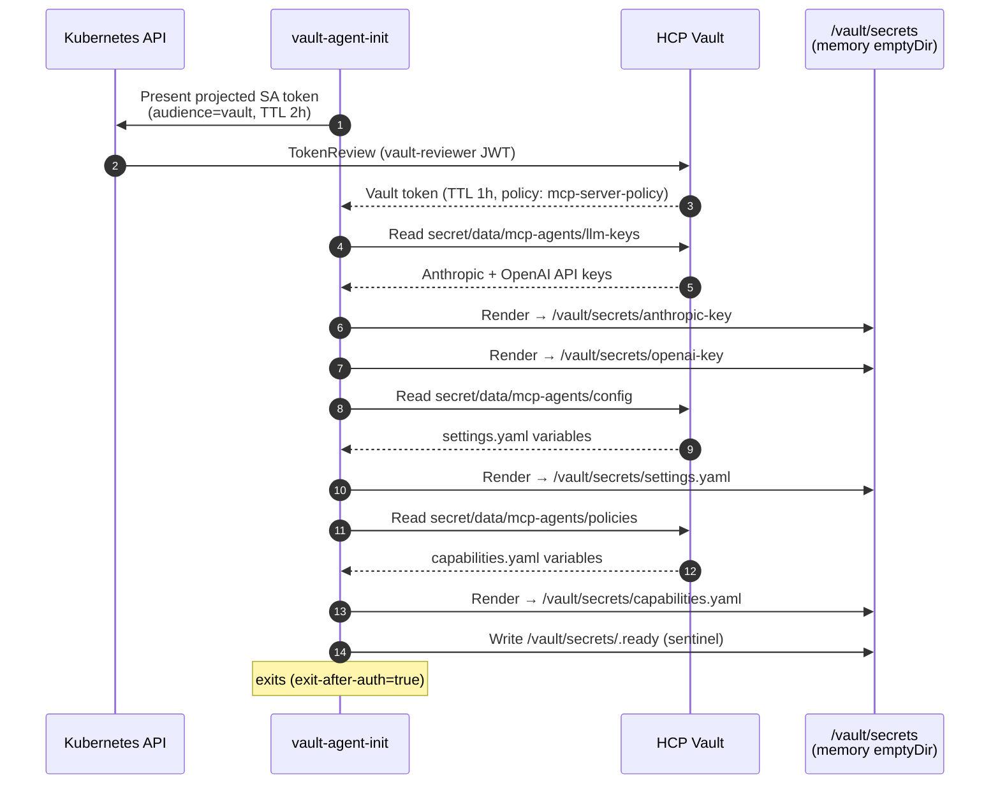
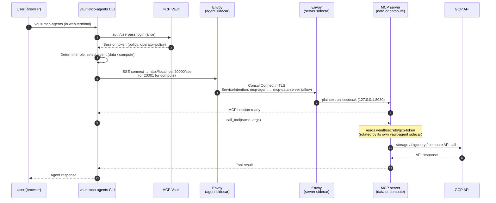
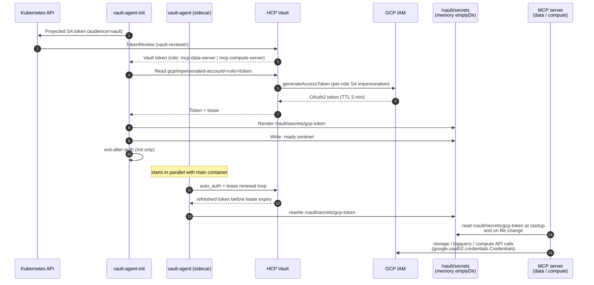

# Architecture — How Vault Brokers Secrets to Agents and MCP Servers

A deep dive on how Vault and the MCP pods exchange credentials at runtime. Read [`README.md`](../README.md) first for the at-a-glance flow; this doc covers per-pod auth, what each `vault-agent` container renders, and the full lifetime of every secret.

For the Vault ↔ Consul side (PKI as the Connect CA, vault-agent on the Consul VMs, TLS renewal), see [`docs/mesh.md`](mesh.md).

---

## Two pod shapes in the `mcp-agents` namespace

| Pod | Authenticates as | vault-agent shape | What gets rendered |
|---|---|---|---|
| `mcp-agent` (CLI + ttyd) | Vault role `mcp-server`, SA `mcp-server` | **Init only** (`exit-after-auth=true`) | LLM API keys, `settings.yaml`, `capabilities.yaml` (static at pod boot) |
| `mcp-data-server`, `mcp-compute-server` | Per-server Vault role bound to its own SA | **Init + sidecar** (`exit_after_auth=false`) | `/vault/secrets/gcp-token` from a dynamic GCP impersonation engine, refreshed on its own |

Both pod types use the same Kubernetes auth method (`auth/kubernetes`) and the same projected-SA-token / TokenReview chain — they differ only in role bindings, template content, and whether the agent process keeps running.

---

## Agent pod: Phase 1 — vault-agent init container

The `mcp-agent` pod runs a `vault-agent-init` container before the main container starts. It authenticates to Vault once, renders all static secrets into a shared memory volume, then exits.



**Authentication details:**

| Field | Value |
|---|---|
| Auth method | Kubernetes (`auth/kubernetes`) |
| JWT source | Projected SA token at `/var/run/secrets/vault/token` |
| SA | `mcp-server` in namespace `mcp-agents` |
| Vault role | `mcp-server` — bound to that SA + namespace |
| Token reviewer | `vault-reviewer` SA in `kube-system` (managed by Terraform) |

**Secrets rendered at startup:**

| Vault path | Rendered file | Contents |
|---|---|---|
| `secret/data/mcp-agents/llm-keys` | `/vault/secrets/anthropic-key`<br/>`/vault/secrets/openai-key` | Raw API key values |
| `secret/data/mcp-agents/config` | `/vault/secrets/settings.yaml` | Vault addr, GCP project, agent definitions, MCP server upstream URLs |
| `secret/data/mcp-agents/policies` | `/vault/secrets/capabilities.yaml` | Role → tool allowlists, max GCP token TTL |

All files land in an `emptyDir` volume with `medium: Memory` — they never touch node disk.

---

## Agent pod: Phase 2 — main container startup

`docker/entrypoint.sh` waits for the `.ready` sentinel (max 120 s), then:

```bash
# Read rendered files and export as env vars for the ttyd subprocess
ANTHROPIC_API_KEY=$(cat /vault/secrets/anthropic-key)
OPENAI_API_KEY=$(cat /vault/secrets/openai-key)
export ANTHROPIC_API_KEY OPENAI_API_KEY
exec ttyd ... vault-mcp-agents ...
```

The application reads `settings.yaml` and `capabilities.yaml` from the same volume at import time.

---

## Agent pod: Phase 3 — runtime, per user session

When a user logs in through the web terminal:



The agent process never sees a GCP credential. Two independent trust hops protect every tool call: **Consul Connect mTLS + ServiceIntentions** authorise the agent→server RPC, and the server's own **vault-agent sidecar** mints a fresh 5-minute GCP token from Vault (renewed in place ahead of every lease expiry). `capabilities.yaml` is an LLM-level allow-list layered on top.

---

## MCP server pods (`mcp-data-server`, `mcp-compute-server`)

The data and compute servers don't hold LLM keys, app config, or user sessions — their only Vault dependency is a continuously-fresh GCP OAuth2 token. They use a **vault-agent sidecar** (not just an init container) so Vault keeps the token file rotated for the life of the pod.



| Field | mcp-data-server | mcp-compute-server |
|---|---|---|
| Vault role | `mcp-data-server` | `mcp-compute-server` |
| Pod SA | `mcp-data-server` (mcp-agents ns) | `mcp-compute-server` (mcp-agents ns) |
| Vault path templated | `gcp/impersonated-account/data-agent-gcp/token` | `gcp/impersonated-account/compute-agent-gcp/token` |
| Impersonates | `data-agent-gcp` SA (`storage.objectAdmin`, `bigquery.dataEditor`+`jobUser`) | `compute-agent-gcp` SA (`compute.instanceAdmin.v1`) |

The sidecar is configured with `exit_after_auth = false` and a single `template` block (see `templates/vault-agent-server.hcl.tpl`), so the file at `/vault/secrets/gcp-token` is overwritten in place ahead of every lease expiry. The MCP server reads the file at startup and re-reads it on the next call when authentication fails — no Vault SDK in the server process.

---

## Secret lifetime summary

| Secret | Fetched | TTL | Stored in |
|---|---|---|---|
| Kubernetes projected SA JWT | Pod creation | 2 h | `/var/run/secrets/vault/` (K8s managed) |
| Vault pod token | Init container | 1 h | `/home/vault/.vault-token` (emptyDir) |
| LLM API keys | Init container | Until pod restart | `/vault/secrets/` (memory emptyDir) |
| `settings.yaml`, `capabilities.yaml` | Init container | Until pod restart | `/vault/secrets/` (memory emptyDir) |
| Vault user session token | User login | Policy TTL | Python process memory |
| GCP OAuth2 token (MCP server pods) | vault-agent sidecar lease loop | 5 min, rewritten before expiry | `/vault/secrets/gcp-token` (memory emptyDir) |

---

## Defence-in-depth for tool access

Four independent layers gate every tool invocation:

1. **Vault policy layer** — the pod's vault-agent token only allows reading specific GCP impersonated-account paths.
2. **Consul intentions layer** — `ServiceIntention` resources authorise the mTLS hop from `mcp-agent` to each server by name; without an `allow`, the mesh refuses the connection.
3. **Application policy layer** — `capabilities.yaml` maps (role, agent) → allowed tool names; the LLM only sees the union.
4. **GCP IAM layer** — each agent's impersonated SA has only the permissions it needs (`storage.objectAdmin` not `storage.admin`, etc.).

A compromise at any single layer is bounded by the layers below it.
