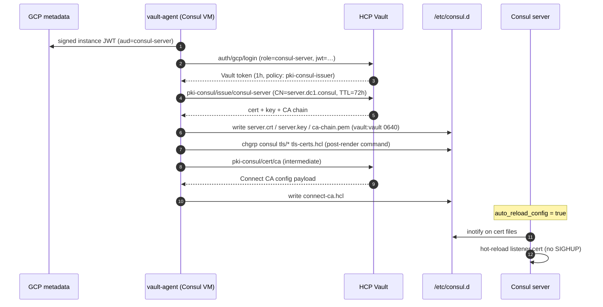

# Mesh — Vault ↔ Consul Integration

Vault plays two roles for Consul: it is the **Connect CA provider** (every mTLS leaf cert in the mesh is issued via Vault PKI) and the **server-TLS source** (the gossip + RPC listener cert/key/CA). Both flows are driven by a `vault-agent` running on each Consul server VM — no operator-supplied secrets, no cert material in Packer images or Terraform state.

Read [`README.md`](../README.md) for the at-a-glance picture and [`docs/architecture.md`](architecture.md) for the GKE-pod side of credential brokering.

---

## Authentication: GCP IAM, not Kubernetes

Consul servers are GCE instances, not pods, so the K8s auth method doesn't apply. They authenticate via Vault's **GCP IAM auth method**:

| Field | Value |
|---|---|
| Auth method | `auth/gcp` (type `iam`) |
| Identity | Instance metadata-service signed JWT, audience = Vault role |
| Vault role | `consul-server` — bound to the Consul server SA email |
| Token policy | `pki-consul-issuer` + `kv-consul-acl-token` (read CA, issue leaf certs, read bootstrap token) |

The same SA is referenced by the scenario's `vault-pki` PKI roles and by the GCE instance — the `consul_server_sa_email` input wires both together so the prefix can never drift (this was historically a foot-gun; see CLAUDE.md / MEMORY.md).

---

## What vault-agent renders on a Consul server

`packer/configs/vault-agent-consul.hcl.tmpl` defines four `template` blocks; vault-agent renders them at boot and refreshes them as leases approach expiry.

| Template destination | Vault source | Used by Consul for |
|---|---|---|
| `/etc/consul.d/tls/ca-chain.pem` | `pki-consul/cert/ca_chain` | TLS trust anchor (RPC + HTTPS API) |
| `/etc/consul.d/tls/server.crt` + `server.key` | `pki-consul/issue/consul-server` (72h leaf) | TLS listener cert/key |
| `/etc/consul.d/tls-certs.hcl` | n/a (paths only) | `tls { defaults { cert_file=… key_file=… ca_file=… } }` block |
| `/etc/consul.d/connect-ca.hcl` | `pki-consul/cert/ca` (intermediate) | `connect { ca_provider = "vault" ca_config { … } }` — tells Consul to use Vault PKI as the Connect CA |

---

## Permission plumbing on the VM

A few non-obvious file-permission rules exist because vault-agent and Consul run as different Unix users:

- vault-agent writes everything as `vault:vault 0640`.
- Packer adds `consul` to the `vault` group (`usermod -aG vault consul`) so it can read those files.
- Each template's post-render `command` runs `chgrp consul …` on the rendered files (defence-in-depth — the template engine drops setgid otherwise).
- `/etc/consul.d/` is `0770` and `/etc/consul.d/tls/` is `2770` (setgid) so vault-agent can write into them.

Losing any one of these breaks Consul boot — see CLAUDE.md "Consul TLS" for the full failure-mode catalogue.

---

## Cert renewal — without `systemctl reload`

vault-agent v1.21.3 fixed a long-standing `pkiCert` non-renewal bug, so the templates renew themselves. As belt-and-braces:

- A systemd timer runs `vault-agent-cert-refresh.sh` every 60 hours (cert TTL is 72h). The script issues a fresh cert via the Vault PKI REST API and replaces the files atomically.
- Consul has `auto_reload_config = true` in `consul-server.hcl`, so it picks up the new cert files via inotify — **no SIGHUP, no `systemctl reload consul`**.
- This matters because reloading Consul causes it to re-initialize the Vault Connect CA provider, which mints a fresh Connect intermediate CA and invalidates every mesh leaf cert in flight. Use `task consul:refresh-tls` (or run the refresh script directly) for cert renewal — never `systemctl reload`.

---

## GKE side: how pods trust the Connect CA

GKE pods that join the mesh (via the Consul Helm chart's connect-injector) need the same Connect intermediate CA chain that the VMs are using. That's brokered as a Kubernetes Secret rather than a Vault read:

- `kubernetes_secret.consul_ca_cert` (key `tls.crt`) is seeded by Terraform during Phase 2 and lives in the `consul` namespace.
- It has `lifecycle { ignore_changes = [data] }` — Terraform never overwrites the live data after creation.
- `task consul:refresh-tls` re-reads `ca-chain.pem` from the running Consul VM and `kubectl apply`s it back into the secret. Run it before every Helm deploy (and any time the Connect CA actually rotates) to keep the cluster's trust anchor in sync.

---

## Why this design

- **Single CA root for VM TLS *and* Connect mTLS** — operators audit one PKI, not two. PKI TTLs (root 10y, intermediate 5y, leaf 72h) are uniform across the mesh.
- **No long-lived TLS material on the VM** — Packer images contain no certs; a hijacked image can't impersonate a server without first authenticating to Vault as the consul-server GCP SA.
- **No app-level secret distribution code** — neither Consul nor the MCP servers contain Vault-client SDK calls for TLS or GCP credentials. vault-agent owns the lease loop; the apps just read files.
